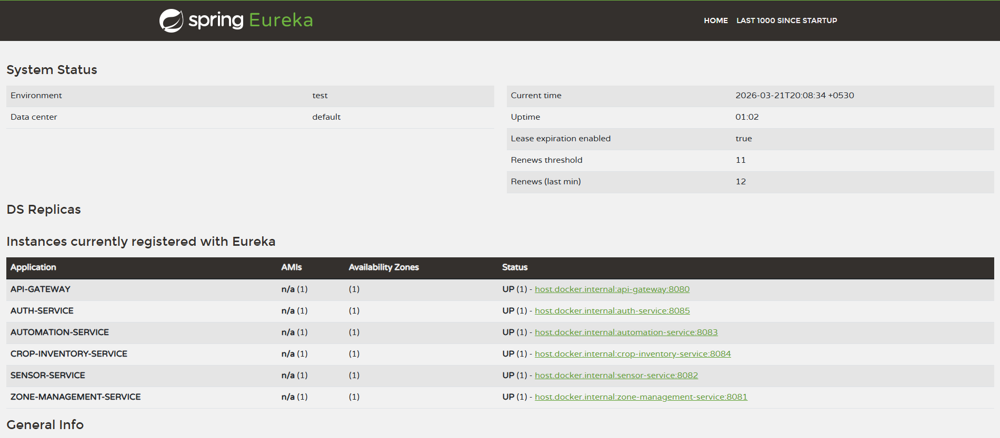

# 🌿 Automated Greenhouse Management System (AGMS)
### Microservice-Based Application | Spring Boot & Spring Cloud

---

## 📋 Project Overview

AGMS is a cloud-native microservices platform for automated greenhouse management.
It connects to a Live External IoT Data Provider API to fetch real-time temperature
and humidity data, processes it through a rule engine, and triggers automated actions
to maintain ideal growing conditions.

---

## 🏗️ System Architecture
```
                    ┌─────────────────┐
                    │   API Gateway   │
                    │   Port: 8080    │
                    └────────┬────────┘
                             │
              ┌──────────────┼──────────────┐
              │              │              │
    ┌─────────▼──────┐ ┌─────▼──────┐ ┌───▼────────────┐
    │ Zone Service   │ │  Sensor    │ │  Automation    │
    │ Port: 8081     │ │  Service   │ │  Service       │
    │                │ │ Port: 8082 │ │  Port: 8083    │
    └────────────────┘ └────────────┘ └────────────────┘
              │
    ┌─────────▼──────┐
    │ Crop Service   │
    │ Port: 8084     │
    └────────────────┘
```

---

## 🛠️ Technologies Used

| Technology | Purpose |
|-----------|---------|
| Spring Boot 3.x | Core microservice framework |
| Spring Cloud Eureka | Service discovery & registration |
| Spring Cloud Config | Centralized configuration management |
| Spring Cloud Gateway | API routing & JWT security |
| Spring Cloud OpenFeign | Inter-service communication |
| RestTemplate | HTTP client for IoT API calls |
| MySQL | Database for zone & crop data |
| JWT | Authentication & authorization |
| Lombok | Boilerplate code reduction |

---

## 📁 Project Structure
```
agms-system/
├── eureka-server/                  # Service Registry (Port 8761)
├── config-server/                  # Config Server (Port 8888)
├── api-gateway/                    # API Gateway (Port 8080)
├── auth-service/                   # Auth Service (Port 8085)
├── zone-management-service/        # Zone Service (Port 8081)
├── sensor-telemetry-service/       # Sensor Service (Port 8082)
├── automation-service/             # Automation Service (Port 8083)
├── crop-inventory-service/         # Crop Service (Port 8084)
└── agms-collection.json            # Postman Collection
```

---

## ⚙️ Prerequisites

Before running the project, make sure you have:

- ☑️ Java 17 or higher installed
- ☑️ Maven 3.8+ installed
- ☑️ MySQL 8.0+ installed and running
- ☑️ Git installed
- ☑️ Postman (for API testing)
- ☑️ IntelliJ IDEA or any Java IDE

---

## 🗄️ Database Setup

Create the required MySQL databases:
```sql
CREATE DATABASE agms_zone_db;
CREATE DATABASE agms_automation_db;
CREATE DATABASE agms_crop_db;
```

Or let Spring auto-create them (already configured with `createDatabaseIfNotExist=true`).

---

## 🚀 Startup Instructions

### ⚠️ IMPORTANT: Services must be started in this exact order!

---

### Step 1 — Start Eureka Server (Service Registry)
```bash
cd eureka-server
mvn spring-boot:run
```
✅ Verify: Open http://localhost:8761
You should see the Eureka dashboard.

---

### Step 2 — Start Config Server
```bash
cd config-server
mvn spring-boot:run
```
✅ Verify: Open http://localhost:8888/zone-service/default
You should see zone-service configuration properties.

Config Server fetches properties from:
📦 https://github.com/Alokafernando/agms-config-repo

---

### Step 3 — Start API Gateway
```bash
cd api-gateway
mvn spring-boot:run
```
✅ Verify: Service appears in Eureka dashboard as API-GATEWAY

---

### Step 4 — Start Auth Service
```bash
cd auth-service
mvn spring-boot:run
```
✅ Verify: Service appears in Eureka dashboard as AUTH-SERVICE

---

### Step 5 — Start Zone Management Service
```bash
cd zone-management-service
mvn spring-boot:run
```
✅ Verify: Service appears in Eureka dashboard as ZONE-SERVICE

---

### Step 6 — Start Sensor Telemetry Service
```bash
cd sensor-telemetry-service
mvn spring-boot:run
```
✅ Verify: Service appears in Eureka dashboard as SENSOR-SERVICE

---

### Step 7 — Start Automation Service
```bash
cd automation-service
mvn spring-boot:run
```
✅ Verify: Service appears in Eureka dashboard as AUTOMATION-SERVICE

---

### Step 8 — Start Crop Inventory Service
```bash
cd crop-inventory-service
mvn spring-boot:run
```
✅ Verify: Service appears in Eureka dashboard as CROP-INVENTORY-SERVICE

---

## 🌐 Service URLs

| Service | URL | Description |
|---------|-----|-------------|
| Eureka Dashboard | http://localhost:8761 | Service registry |
| Config Server | http://localhost:8888 | Configuration management |
| API Gateway | http://localhost:8080 | Single entry point |
| Auth Service | http://localhost:8085 | Authentication |
| Zone Service | http://localhost:8081 | Zone management |
| Sensor Service | http://localhost:8082 | Telemetry data |
| Automation Service | http://localhost:8083 | Rule engine |
| Crop Service | http://localhost:8084 | Crop inventory |
| External IoT API | http://104.211.95.241:8080/api | Live sensor data |

---

## 🔐 Authentication

### Local Auth Service
```
POST http://localhost:8085/api/auth/login
{
  "username": "buddhika",
  "password": "1234"
}
```

### External IoT API Auth
```
POST http://104.211.95.241:8080/api/auth/login
{
  "username": "buddhika",
  "password": "1234"
}
```

---

## 📡 API Endpoints

### Zone Management (Port 8081)
| Method | URL | Description |
|--------|-----|-------------|
| POST | /api/zones | Create zone + register IoT device |
| GET | /api/zones | Get all zones |
| GET | /api/zones/{id} | Get zone by ID |
| PUT | /api/zones/{id} | Update zone thresholds |
| DELETE | /api/zones/{id} | Delete zone |

### Sensor Telemetry (Port 8082)
| Method | URL | Description |
|--------|-----|-------------|
| GET | /api/sensors/latest | Get latest sensor readings |
| GET | /api/sensors | Get all devices |

### Automation Service (Port 8083)
| Method | URL | Description |
|--------|-----|-------------|
| POST | /api/automation/process | Process sensor data |
| GET | /api/automation/logs | Get automation logs |

### Crop Inventory (Port 8084)
| Method | URL | Description |
|--------|-----|-------------|
| POST | /api/crops | Register new crop batch |
| GET | /api/crops | Get all crops |
| GET | /api/crops/{id} | Get crop by ID |
| PUT | /api/crops/{id}/status?status= | Update crop status |

---

## 🔄 End-to-End Data Flow
```
1. IoT API Login → Get Bearer Token
2. Register Device → Get deviceId
3. Create Zone → Store deviceId
4. SensorFetcher (every 10s) → Fetch telemetry from IoT API
5. Store reading → Update SensorReadingStore
6. Push to Automation → Rule engine evaluates
7. If Temp > maxTemp → Log TURN_FAN_ON
8. If Temp < minTemp → Log TURN_HEATER_ON
```

---

## 🌱 Crop Lifecycle State Machine
```
SEEDLING → VEGETATIVE → HARVESTED
```
- SEEDLING can only move to VEGETATIVE
- VEGETATIVE can only move to HARVESTED  
- HARVESTED is final state — cannot be changed

---

## 🧪 Testing

Import the Postman collection:
1. Open Postman
2. Click **Import**
3. Select `agms-collection.json` from project root
4. All endpoints are pre-configured and ready to test

---

## 📸 Eureka Dashboard

All services registered and UP:



---

## 📝 Configuration

All service configurations are managed centrally via Spring Cloud Config Server.
Config files are stored in:
🔗 https://github.com/Alokafernando/agms-config-repo

| Config File | Service |
|-------------|---------|
| zone-service.yml | Zone Management Service |
| sensor-service.yml | Sensor Telemetry Service |
| automation-service.yml | Automation Service |
| crop-inventory-service.yml | Crop Inventory Service |

---

## 👨‍💻 Author

**Buddhika Fernando**  
IJSE - Automated Greenhouse Management System  
2026
